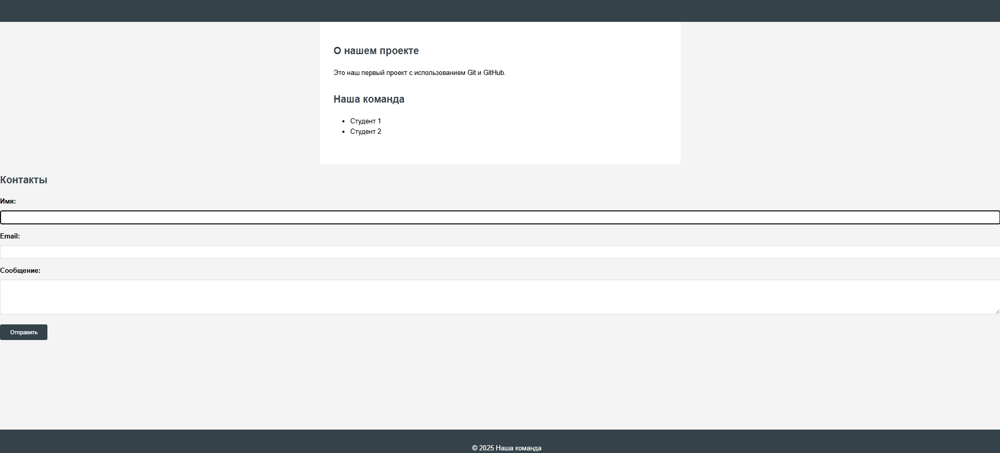

# Отчет по слиянию изменений

**Дата:** [29.09.2025]  
**Команда:** [Микаелян Маис] и [Шелков Данила]

## Выполненные действия:

### Pull Requests:
- PR студента 1: [(https://github.com/Dedyretti/my-first-project/pull/1)] ✅
- PR студента 2: [https://github.com/mayis25/my-first-project/pull/1] ✅

### Code Review:
- [+] Оба PR проверены
- [+] Оба PR approved

### Слияние:
- [+] Оба PR успешно слиты в main
- [+] Ветки удалены на GitHub (опционально)

### Обновление локальной копии:
- [+] Локальная ветка main обновлена
- [+] Все изменения присутствуют

## Проверка финального результата:
1. Откройте index.html в браузере
2. [+] Раздел "Навыки" отображается
3. [+] Форма "Контакты" отображается
4. [+] Все стили работают корректно

## Скриншоты:

## Проблемы и решения:
[-]

## Вывод:
[-]